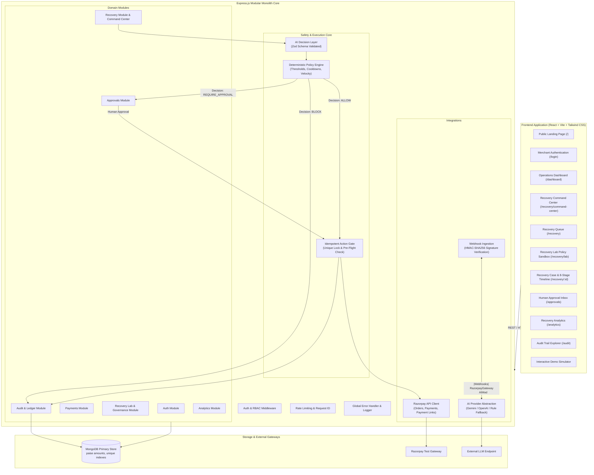
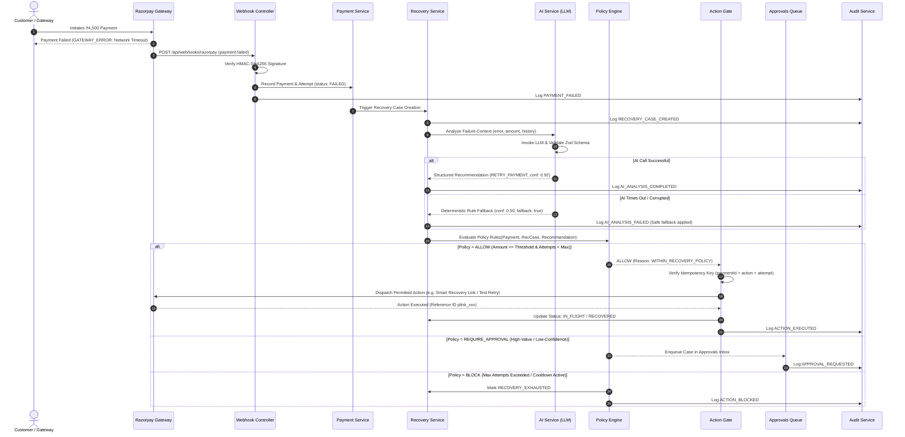

# RecoverAI — System Architecture

## 1. System Overview

RecoverAI is an enterprise-grade AI revenue recovery platform built for merchants processing payments via Razorpay. It intercepts failed payments, extracts technical and behavioral context, leverages an isolated Large Language Model to evaluate recovery feasibility and recommend mitigation strategies, evaluates deterministic policy constraints, and safely executes permitted actions through an idempotent action gate.

---

## 2. Architectural Blueprint

---

## 3. End-to-End Recovery Flow

---

## 4. Domain Module Responsibilities

| Module | Location | Primary Responsibilities |
| :--- | :--- | :--- |
| **Auth** | `server/src/modules/auth` | JWT issuance, cookie management, role-based authorization (Admin, Ops Manager, Viewer) |
| **Payments** | `server/src/modules/payments` | Payment ingestion, attempt history, strict state transitions, paise integer storage |
| **Recovery** | `server/src/modules/recovery` | Recovery case lifecycle, context generation, strategy orchestration |
| **AI** | `server/src/modules/ai` | Provider abstraction, structured JSON prompting, Zod schema validation, safe rule fallback |
| **Policy** | `server/src/modules/policy` | Pure deterministic rules: cooldowns, retry limits, risk thresholds, approval checks |
| **Actions** | `server/src/modules/actions` | Action gate, idempotency lock generation, pre-flight gatekeeper, gateway dispatch |
| **Approvals** | `server/src/modules/approvals` | Human-in-the-loop review workflow, audit-tracked Approve/Reject transitions |
| **Audit** | `server/src/modules/audit` | Append-only immutable ledger recording actor, correlation ID, entity ID, and sanitised payload |
| **Analytics** | `server/src/modules/analytics` | Real-time recovery rates, revenue recovered, failure breakdowns, SLA tracking |
| **Webhooks** | `server/src/modules/webhooks` | Secure HMAC-SHA256 signature verification, event deduplication, background pipeline kickoff |

---

## 5. Security & Failure Boundaries

1. **AI Boundary:** The AI module operates inside an isolated sandbox. It has zero network access to the Razorpay integration layer and cannot trigger database mutations directly.
2. **Action Gate:** External gateway mutations are exclusively dispatched via the Action Gate after passing idempotency and policy validation.
3. **Integer Money Boundary:** All amounts entering the system are immediately converted to integers (paise). Floating-point values are rejected at the API schema validation layer.
