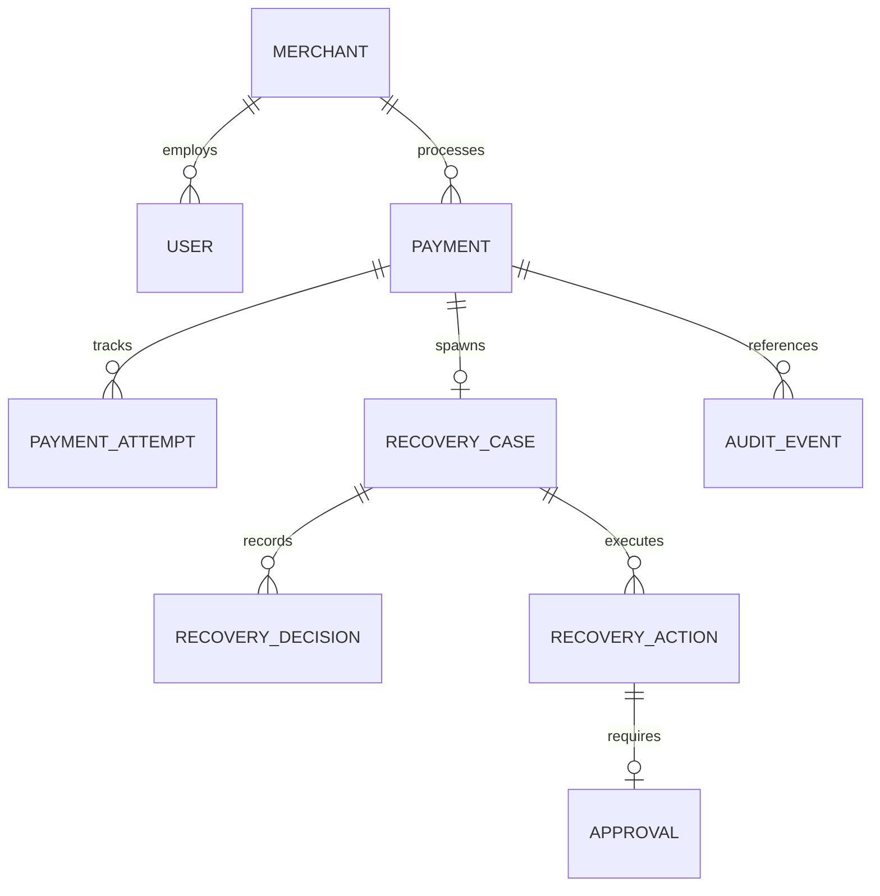

# RecoverAI — Database Schema & Data Model Specification

## 1. Monetary Design Standard

To prevent catastrophic floating-point rounding errors (e.g. `0.1 + 0.2 = 0.30000000000000004`), **all financial values across RecoverAI are stored exclusively as 64-bit integers in the smallest currency unit: paise** (1 INR = 100 paise).
- ₹1.00 = `100` paise
- ₹4,500.50 = `450050` paise
- ₹12,000.00 = `1200000` paise

All arithmetic in domain modules uses native integer arithmetic. Formatting to localized currency strings occurs strictly at the presentation layer.

---

## 2. Entity Relationship Overview

---

## 3. Collections Specification

### 3.1 `merchants`
- **Purpose:** Represents the merchant business account and custom policy configurations.
- **Indexes:** `{ merchantId: 1 }` (unique)
- **Key Fields:**
  - `merchantId` (String, unique): Primary business slug (e.g. `merch_corp_01`)
  - `name` (String): Business display name
  - `email` (String): Merchant administrative email
  - `currency` (String, default: 'INR')
  - `policyConfig` (Object):
    - `autoActionMaxAmountPaise` (Number, default: 500000)
    - `maxRecoveryAttempts` (Number, default: 3)
    - `cooldownPeriodMinutes` (Number, default: 15)
    - `minConfidenceAutoAction` (Number, default: 0.75)
  - `timestamps` (createdAt, updatedAt)

---

### 3.2 `users`
- **Purpose:** Merchant operators, managers, and auditors accessing the console.
- **Indexes:** `{ email: 1 }` (unique), `{ merchantId: 1 }`
- **Key Fields:**
  - `email` (String, unique): User login email
  - `passwordHash` (String): Salted bcrypt hash
  - `name` (String): Operator full name
  - `role` (Enum): `'ADMIN' | 'OPS_MANAGER' | 'VIEWER'`
  - `merchantId` (ObjectId ref: 'Merchant')
  - `timestamps` (createdAt, updatedAt)

---

### 3.3 `payments`
- **Purpose:** Primary ledger of all customer payment attempts and states.
- **Indexes:** `{ paymentId: 1 }` (unique), `{ orderId: 1 }`, `{ merchantId: 1, status: 1 }`
- **Key Fields:**
  - `paymentId` (String, unique): Razorpay Payment ID (`pay_xxx`)
  - `orderId` (String): Razorpay Order ID (`order_xxx`)
  - `merchantId` (ObjectId ref: 'Merchant')
  - `amount` (Number): Integer amount in **paise**
  - `currency` (String, default: 'INR')
  - `status` (Enum): `'CREATED' | 'AUTHORIZED' | 'CAPTURED' | 'FAILED' | 'REFUNDED'`
  - `customer` (Object): `{ id, name, email, contact }`
  - `method` (Enum): `'card' | 'upi' | 'netbanking' | 'wallet' | 'emi'`
  - `failureCode` (String): E.g. `BAD_REQUEST_ERROR`, `GATEWAY_ERROR`
  - `failureReason` (String): Descriptive error message
  - `failureCategory` (Enum): `'TEMPORARY_NETWORK' | 'INSUFFICIENT_FUNDS' | 'AUTHENTICATION_FAILED' | 'BANK_DOWNTIME' | 'EXPIRED_CARD' | 'CUSTOMER_ABANDONED' | 'FRAUD_SUSPECTED' | 'UNKNOWN'`
  - `metadata` (Object): Custom arbitrary key-values from checkout

---

### 3.4 `paymentAttempts`
- **Purpose:** Records each individual transaction attempt against the gateway for a given payment.
- **Indexes:** `{ attemptId: 1 }` (unique), `{ paymentId: 1, attemptNumber: 1 }`
- **Key Fields:**
  - `attemptId` (String, UUID)
  - `paymentId` (ObjectId ref: 'Payment')
  - `attemptNumber` (Number, integer >= 1)
  - `status` (Enum): `'SUCCESS' | 'FAILED'`
  - `errorCode` (String)
  - `errorDescription` (String)
  - `rawGatewayResponse` (Object): Sanitized gateway payload

---

### 3.5 `recoveryCases`
- **Purpose:** Tracks the lifecycle of a recovery investigation for a failed transaction.
- **Indexes:** `{ caseId: 1 }` (unique), `{ paymentId: 1 }` (unique), `{ status: 1 }`, `{ priority: 1 }`
- **Key Fields:**
  - `caseId` (String, unique): Human-readable ID (e.g. `REC-2026-90412`)
  - `paymentId` (ObjectId ref: 'Payment', unique)
  - `merchantId` (ObjectId ref: 'Merchant')
  - `status` (Enum): `'PENDING_ANALYSIS' | 'ANALYZED' | 'ACTION_SCHEDULED' | 'APPROVAL_REQUIRED' | 'IN_FLIGHT' | 'RECOVERED' | 'EXHAUSTED' | 'CLOSED_UNRECOVERABLE'`
  - `recoverabilityScore` (Number): 0.00 to 1.00
  - `recoverabilityTier` (Enum): `'HIGH' | 'MEDIUM' | 'LOW' | 'NONE'`
  - `priority` (Enum): `'CRITICAL' | 'HIGH' | 'MEDIUM' | 'LOW'`
  - `attemptCount` (Number, integer, default: 0)
  - `maxAttemptsAllowed` (Number, integer, default: 3)
  - `lastAttemptAt` (Date)
  - `nextEligibleAttemptAt` (Date)
  - `finalOutcome` (Enum): `'RECOVERED' | 'UNRECOVERED' | null`

---

### 3.6 `recoveryDecisions`
- **Purpose:** Permanent record of every AI (or fallback) analysis for auditable decision verification.
- **Indexes:** `{ decisionId: 1 }` (unique), `{ caseId: 1 }`
- **Key Fields:**
  - `decisionId` (String, UUID)
  - `caseId` (ObjectId ref: 'RecoveryCase')
  - `aiProvider` (Enum): `'gemini' | 'openai' | 'rule_fallback'`
  - `rawModelResponse` (String): Exact JSON string returned by model
  - `parsedRecommendation` (Object):
    - `recommendedStrategy` (Enum): `'RETRY_PAYMENT' | 'SEND_PAYMENT_REMINDER' | 'CREATE_RECOVERY_CASE' | 'ESCALATE_TO_MERCHANT' | 'MARK_UNRECOVERABLE' | 'REQUEST_HUMAN_APPROVAL'`
    - `confidence` (Number): 0.00 to 1.00
    - `priority` (Enum): `'CRITICAL' | 'HIGH' | 'MEDIUM' | 'LOW'`
    - `reason` (String): Concise decision rationale
    - `contextualSignals` (Array of Strings)
  - `validationStatus` (Enum): `'VALID' | 'SCHEMA_REJECTED' | 'FALLBACK_APPLIED'`

---

### 3.7 `recoveryActions`
- **Purpose:** Audit record of permitted actions vetted by the policy engine and dispatched to gateways.
- **Indexes:**
  - `{ actionId: 1 }` (unique)
  - `{ paymentId: 1, actionType: 1, attemptNumber: 1 }` (unique: **Idempotency Guard**)
  - `{ caseId: 1 }`
- **Key Fields:**
  - `actionId` (String, UUID)
  - `caseId` (ObjectId ref: 'RecoveryCase')
  - `paymentId` (ObjectId ref: 'Payment')
  - `actionType` (Enum): Action vocabulary
  - `idempotencyKey` (String, unique compound hash)
  - `policyDecision` (Enum): `'ALLOW' | 'REQUIRE_APPROVAL' | 'BLOCK'`
  - `policyReasonCode` (String)
  - `status` (Enum): `'PENDING_APPROVAL' | 'SCHEDULED' | 'EXECUTING' | 'COMPLETED' | 'FAILED' | 'BLOCKED' | 'REJECTED'`
  - `executionDetails` (Object):
    - `gatewayOperation` (String)
    - `isSimulated` (Boolean, default: false)
    - `externalReferenceId` (String): Razorpay payment link or order ID
    - `responsePayload` (Object)
    - `errorMessage` (String)
  - `executedAt` (Date)

---

### 3.8 `approvals`
- **Purpose:** Human-in-the-loop review queue for transactions flagged as high-value or high-risk.
- **Indexes:** `{ approvalId: 1 }` (unique), `{ caseId: 1 }`, `{ status: 1 }`
- **Key Fields:**
  - `approvalId` (String, UUID)
  - `caseId` (ObjectId ref: 'RecoveryCase')
  - `actionId` (ObjectId ref: 'RecoveryAction')
  - `status` (Enum): `'PENDING' | 'APPROVED' | 'REJECTED'`
  - `requestedAction` (String)
  - `aiRationale` (String)
  - `policyReason` (String)
  - `riskFlags` (Array of Strings)
  - `reviewedBy` (ObjectId ref: 'User')
  - `reviewedAt` (Date)
  - `reviewNotes` (String)

---

### 3.9 `auditEvents`
- **Purpose:** Immutable, tamper-evident operational ledger recording every state mutation.
- **Indexes:** `{ eventId: 1 }` (unique), `{ entityId: 1 }`, `{ eventType: 1 }`, `{ timestamp: -1 }`
- **Key Fields:**
  - `eventId` (String, UUID)
  - `eventType` (Enum): Standardized operational lifecycle event
  - `entityType` (Enum): `'PAYMENT' | 'RECOVERY_CASE' | 'ACTION' | 'APPROVAL' | 'WEBHOOK'`
  - `entityId` (String): Identifier of affected entity
  - `actor` (Object): `{ type: 'SYSTEM' | 'AI_AGENT' | 'USER' | 'WEBHOOK', id: String, role: String }`
  - `requestId` (String): Correlation trace ID
  - `payload` (Object): Sanitized state delta or event payload
  - `timestamp` (Date, default: Date.now)
