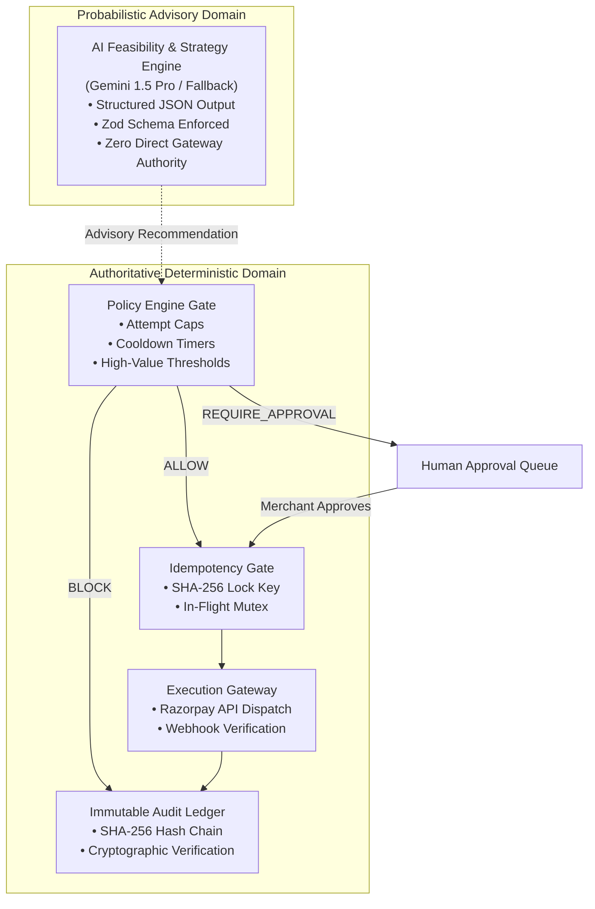
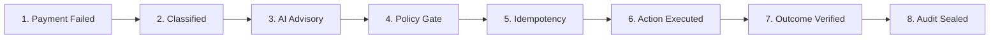

# RecoverAI — Recovery Orchestration & Decision Architecture

## 1. Core Product Principle

> **"AI recommends. Deterministic systems authorize and execute."**

In autonomous fintech systems, Large Language Models (LLMs) cannot possess direct execution authority over financial transactions or gateway mutations. RecoverAI enforces an architectural boundary between probabilistic intelligence and authoritative execution:

---

## 2. The 8-Stage Decision Timeline

Every payment recovery case progresses through an immutable 8-stage lifecycle. Each stage defines its authority model, input signals, and validation invariants:

### Stage Breakdown

| Stage | Stage Name | Authority Model | Description | Telemetry Captured |
| :---: | :--- | :---: | :--- | :--- |
| **1** | `PAYMENT_FAILED` | **Deterministic Ingestion** | Ingestion of `payment.failed` event from Razorpay webhook or synchronous API failure. | Payment ID, amount (paise), failure code, customer ID, order ID |
| **2** | `FAILURE_CLASSIFIED` | **Deterministic Classification** | Rule-based mapping of raw gateway error codes into standardized failure categories (`BANK_DOWNTIME`, `INSUFFICIENT_FUNDS`, `NETWORK_TIMEOUT`, `AUTHENTICATION_ERROR`, `CUSTOMER_ABANDONMENT`, `RISK_REJECTED`). | Failure category, transient vs permanent flag, diagnostic tags |
| **3** | `AI_RECOMMENDATION` | **Probabilistic Advisory** | Isolated LLM evaluation producing structured recoverability score ($0.00-1.00$), strategy recommendation, and natural-language rationale. | Model provider, confidence score, tier (`HIGH`/`MEDIUM`/`LOW`/`UNRECOVERABLE`), recommended strategy, rationale |
| **4** | `POLICY_EVALUATION` | **Authoritative Deterministic** | Hard invariant verification: payment state invariance, max retry attempts cap, mandatory cooldown window, high-value threshold (`POL-001` through `POL-004`). | Verdict (`ALLOW`, `REQUIRE_APPROVAL`, `BLOCK`), triggered rules, evaluated limits |
| **5** | `IDEMPOTENCY_CHECK` | **Authoritative Deterministic** | Atomic locking using SHA-256 idempotency key (`caseId + attemptCount + strategy`) to prevent race conditions or double-charging. | Lock key, lock acquisition timestamp, lock state |
| **6** | `RECOVERY_ACTION` | **Authoritative Execution** | External gateway dispatch via Razorpay API (e.g., smart retry schedule, payment link generation, alternative routing) or human review routing. | Action ID, action type, target gateway, payload reference |
| **7** | `EXECUTION_OUTCOME` | **Deterministic Verification** | Confirmation of recovery outcome via synchronous gateway response or asynchronous webhook verification. | Gateway status (`PAID`, `EXPIRED`, `PENDING`), recovered amount (paise), verification timestamp |
| **8** | `AUDIT_RECORDED` | **Immutable Ledger** | Tamper-evident recording of all state transitions into the immutable append-only audit ledger with SHA-256 hash chains. | Event ID, previous hash, payload hash, actor, signature |

---

## 3. Recovery Command Center Integration

The **Recovery Command Center** (`/recovery/command-center`) provides operational oversight across all 8 stages:

1. **Live Orchestration Funnel**: Real-time counter of transactions at each stage of the recovery pipeline.
2. **Deterministic KPIs**:
   - Total Failed Volume vs Gross Recovered Volume (in integer paise).
   - Recovery Yield Rate (%) and Active Recoverable Volume.
   - Idempotency Block count (zero double-charges guaranteed).
   - Pending Human Approval count.
3. **Multi-Dimensional Failure Intelligence**:
   - Failure category distribution with associated recovery success rates.
   - Payment method breakdown (UPI vs Card vs Netbanking vs Wallet).
   - Error code frequency matrix with mitigation strategies.
